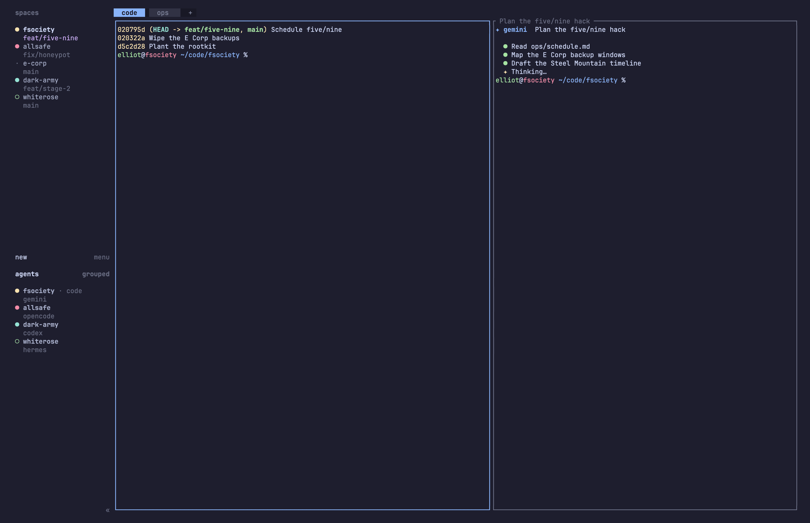
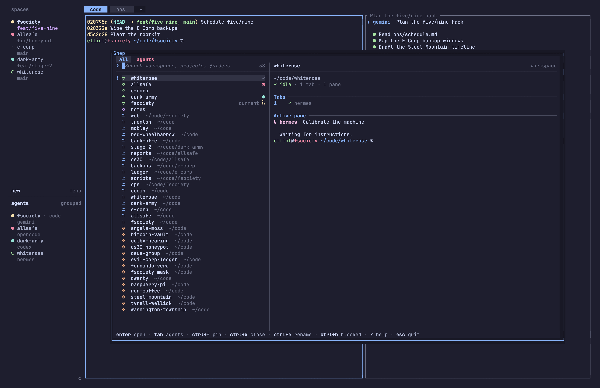

# shep

[](https://github.com/tranceh2/shep/actions/workflows/ci.yml)
[](https://goreportcard.com/report/github.com/tranceh2/shep)
[](LICENSE)

`shep` is a fast, keyboard-driven project, workspace, and AI agent launcher built for [Herdr](https://herdr.dev).

It brings the instant session-hopping experience of tools like `tmux` + `sesh` into Herdr. Press a single global shortcut from anywhere to search across active workspaces, recent project directories, and background AI coding agents, and jump straight into context.

<p align="center">
  
</p>

<p align="center"><sub>The same demo as a <a href="docs/media/shep-demo.mp4">video</a> (3456×2234, 24 s).</sub></p>

---

## Story & Honest Disclaimer

I used `tmux` for years and became completely addicted to the fast session-switching workflow powered by [sesh](https://github.com/joshmedeski/sesh) (by Josh Medeski). When I moved my primary terminal setup to [Herdr](https://herdr.dev), I missed that exact feeling: a single hotkey to search across active workspaces, zoxide history, and project directories without thinking about window IDs or paths.

**An honest note on the code:** I am not a professional Go developer (I probably know about 5% of Go syntax). This entire project was created, designed, and iterated using AI assistance to solve real friction in my day-to-day work. 

Because it grew organically for personal use, there are definitely areas that can be improved:
- Code structure and idioms could be cleaner and more idiomatic Go.
- Edge-case stability and performance under extreme workloads (e.g. scanning tens of thousands of nested repositories).
- Visual design and layout polish across different terminal sizes and fonts.
- Multi-platform testing (it is primarily built and tested on macOS/Linux).

I'm sharing it in case someone else in the Herdr or terminal community finds it useful. If you know Go, spot an architectural flaw, or want to make it faster or more robust, **pull requests and feedback are genuinely appreciated!**

---

## Features

- ⚡ **Instant Picker, Even After Idle:** The first frame renders immediately and keys typed right after the shortcut are kept. Inside Herdr every request goes straight to Herdr's socket instead of launching the `herdr` CLI, so the popup and its workspace rows appear in about 100 ms even after the system has evicted the binaries from memory. Slow sources (the projects scan, custom commands) show their last result at once and refresh in the background. Zero disk I/O while typing.
- ✍️ **Act Without Leaving the Picker:** Rename a workspace, tab or pane in place (`Ctrl+E`), close it (`Ctrl+X`), open a new Git worktree of a repository on a branch you name (`Ctrl+N`), jump to the next blocked agent (`Ctrl+B`), bring back an earlier search (`Ctrl+Y`), and walk a workspace's tabs and panes with the arrows or `Ctrl+H` / `Ctrl+L`.
- 🤖 **AI Agents Attention Queue:** The `agents` tab (in the default `all` ↔ `agents` cycle) puts newly unacknowledged blocked (`◉`) or finished (`●`) agents first, then the previous agent even if idle. Other working and idle agents follow available history; the current pane is last unless it needs new attention. Herdr records prior workspace focus, not prior pane focus: if the immediately preceding workspace has no agents or multiple agents, Shep does not promote a guessed prior pane, even if an older Shep selection exists. Selecting an agent focuses its Herdr tab, not an individual pane.
- 🔍 **Extended Fuzzy Filtering (fzf + Snacks style):** Space-separated AND terms, pipe `|` OR matching, exact `'terms`, prefix `^`, suffix `$`, negation `!term`, and field filters (`status:blocked`, `agent:claude`, `source:herdr`, `path:api`).
- 🔁 **True MRU A↔B Jump-Back:** Ships with a native Herdr plugin action (`tranceh2.shep.jump-back`) to toggle back and forth between your two most recently visited workspaces like `prefix + L` in tmux.
- 📐 **Adaptive Ranking & Persistent Pins:** Learns from successful selections using local SQLite WAL storage (private `0600` permissions with auto-quarantine on corruption). Press `Ctrl+F` to pin high-priority entries to the top.
- 🧩 **Hierarchical Groups & Multi-Pane Templates:** Define nested pickers (`type = "group"`), multi-tab/multi-split layouts with custom focus nodes, and `close_on_exit` flags.
- 🎨 **Customizable Rows and Herdr Themes:** Built on Charm's Bubble Tea and Lip Gloss. Every row part, workspace name and preview command is a template over the same data, and colors follow your Herdr theme by default (Herdr's 18 palettes, `[theme.custom]` included) or a theme of your own. `NO_COLOR` gives a structural no-color mode and `[tui].icons = "ascii"` a 7-bit glyph tier. See [Customization](#customization).

---

## Install

### With Herdr (recommended)

You need [Herdr](https://herdr.dev) 0.8.2 or newer. Nothing else: the plugin
downloads the shep binary for your platform from the matching
[GitHub release](https://github.com/Tranceh2/shep/releases) and checks it
against the release checksums.

**1. Install the plugin.** Herdr asks you to confirm.

```sh
herdr plugin install Tranceh2/shep/contrib/herdr-plugin
```

**2. Add a shortcut** to `~/.config/herdr/config.toml`. Keys are written as
`prefix+<key>`; the prefix is whatever `[keys].prefix` sets in that file,
`ctrl+b` if you never changed it. This example opens shep with the prefix
followed by `ctrl+f`:

```toml
[[keys.command]]
key = "prefix+ctrl+f"
type = "plugin_action"
command = "tranceh2.shep.open"
description = "open Shep picker"
```

**3. Reload Herdr's configuration and press the shortcut:**

```sh
herdr server reload-config
```

That is the whole installation. Without a shep config the picker already
lists your open Herdr workspaces and your zoxide directories; everything
below is optional.

### Optional next steps

**Add your project folders.** Create `~/.config/shep/config.toml`:

```toml
version = 3

[sources.projects]
roots = ["~/code"]        # the folders that hold your projects
markers = [".git"]        # what makes a folder a project
recursive = true
max_depth = 3
```

The [Configuration Guide](#configuration-guide-configtoml) lists every
setting, and [`examples/config.toml`](examples/config.toml) is a fuller
starting point.

**Jump back to the previous workspace** with another shortcut (the plugin
keeps the focus history for it; see
[Troubleshooting](#troubleshooting-prefixtab-does-nothing) if it says there
is no previous workspace yet):

```toml
[[keys.command]]
key = "prefix+tab"
type = "plugin_action"
command = "tranceh2.shep.jump-back"
description = "jump to previous workspace"
```

**Check the setup.** The doctor action checks your configured workspaces,
the picker's theme and the `shep` command; its report is in the plugin's
log:

```sh
herdr plugin action invoke doctor --plugin tranceh2.shep
herdr plugin log list --plugin tranceh2.shep
```

### Use `shep` from a shell (`shep link`)

`shep link` is optional: the shortcuts work without it. To also run `shep`
yourself (`shep open <query>`, `shep list --format json`, scripts, the
Television cable in [`cables/shep.toml`](cables/shep.toml), a
`type = "popup"` keybinding), publish the plugin's binary to your `PATH`:

```sh
"${XDG_CONFIG_HOME:-$HOME/.config}"/herdr/plugins/github/tranceh2.shep-*/contrib/herdr-plugin/bin/shep link
```

It creates the symlink `~/.local/bin/shep` (or in `$SHEP_LINK_DIR` /
`$XDG_BIN_HOME`), so plugin updates reach it. `shep unlink` removes it.

### Update or uninstall

Herdr has no update command: uninstall and install again.

```sh
herdr plugin uninstall tranceh2.shep
herdr plugin install Tranceh2/shep/contrib/herdr-plugin
```

Add `--ref v1.0.1` (a tag or a branch) to `install` to pick a version. Your
shep config, pins and history stay where they are.

### Without Herdr

Shep also works as a plain command. Without Herdr, `shep open` prints the
project path it resolves, so shell scripts can `cd` to it.

```sh
go install github.com/tranceh2/shep/cmd/shep@latest   # Go 1.26.4+
nix profile install github:tranceh2/shep               # or: nix run github:tranceh2/shep -- open
```

Or download a binary for Linux or macOS (arm64, amd64) from the
[releases](https://github.com/Tranceh2/shep/releases), or build a clone with
`make install` (to `$(go env GOPATH)/bin`) or `make build` (`./shep`).

### Building the plugin from a checkout

To run the plugin from your own clone (for development), link it and build
it from source, which needs Go 1.26.4+:

```sh
herdr plugin link "$PWD/contrib/herdr-plugin"
SHEP_PLUGIN_BUILD=source bash contrib/herdr-plugin/scripts/build.sh
```

`SHEP_PLUGIN_BUILD=release` only downloads, and unset it downloads first and
builds when the download fails.

---

## Requirements

- **[Herdr](https://herdr.dev) 0.8.2+** — optional but strongly recommended. Shep finds the `herdr` executable through `[herdr].binary`, then `HERDR_BIN_PATH` (set by Herdr for plugins), then `$PATH`; inside Herdr it talks to `HERDR_SOCKET_PATH` directly and uses the CLI only for what the socket does not serve (session lists, older Herdr versions). When Herdr is absent or stopped, `shep` prints the resolved project path to stdout so terminal scripts still work.
- **Go 1.26.4+** — only to build shep yourself (`go install`, a clone, `SHEP_PLUGIN_BUILD=source`); the plugin and the release binaries do not need it.
- **[git](https://git-scm.com)** — optional; used for the `git` preview section, worktree rows in the projects source, and (through Herdr) `Ctrl+N` worktrees.
- **[zoxide](https://github.com/ajeetdsouza/zoxide)** — optional; enabled by default to surface your most frequent directories.
- **[fzf](https://github.com/junegunn/fzf)** — optional external selector fallback.
- **Nerd Font** — required for the built-in source icons to render correctly; without it, those glyphs appear as replacement boxes. Herdr itself already assumes Nerd Fonts. On terminals that cannot render Unicode, `[tui].icons = "ascii"` draws 7-bit ASCII only: no default source icons and ASCII markers. Icons you configure are your own templates and are drawn as written.
- **[lsd](https://github.com/lsd-rs/lsd)** or **[eza](https://github.com/eza-community/eza)** — optional; used for colored, compact directory previews (names only, directories first; falls back to `ls -1Ap`).

---

## Herdr Integration

The plugin `tranceh2.shep` provides the picker popup (action `open`), the
focus-history collector Herdr starts with the session (`watch-history`), the
previous-workspace toggle (`jump-back`, recovered with `start-history`) and
`doctor`. Keybindings name an action as `tranceh2.shep.<id>`; to run one by
hand, give the bare id and the plugin:

```sh
herdr plugin action invoke open --plugin tranceh2.shep
herdr plugin action invoke jump-back --plugin tranceh2.shep
```

The `open` action runs the plugin's own `shep`, which asks Herdr for the
popup over `HERDR_SOCKET_PATH` (`shep popup`, an internal command), so the
shortcut never waits for the `herdr` CLI to start; without a socket the
action falls back to `herdr plugin pane open`.

When running inside a Herdr popup, `shep` detects the active pane and unlocks in-place actions for zoxide, projects and command-only `[[workspaces]]` rows:
- `Ctrl+T`: open the selected candidate as a new **tab** in the current workspace.
- `Ctrl+P`: open the selected candidate as a **split pane** beside your current pane.

See [`docs/herdr-plugin.md`](docs/herdr-plugin.md) for the full plugin reference and [`docs/jump-back.md`](docs/jump-back.md) for jump-back error codes and lifecycle rules.

### Troubleshooting: `prefix+tab` does nothing

If your `prefix+tab` keybinding is already correctly configured (`command =
"tranceh2.shep.jump-back"`) but pressing it does nothing or the picker
reports no previous workspace, the usual cause is that the background
history collector (`watch-history`) is not running — `jump-back` needs
focus events from two distinct workspaces before it has anything to toggle
between.

1. Confirm the keybinding uses the fully-qualified plugin action command:
   `command = "tranceh2.shep.jump-back"`.
2. Reload Herdr's configuration: `herdr server reload-config`.
3. Start (or recover) the collector for the current session:
   ```sh
   herdr plugin action invoke start-history --plugin tranceh2.shep
   ```
4. Focus two distinct Herdr workspaces (switch to workspace A, then
   workspace B) so the collector observes two focus events.
5. Retry `prefix+tab`, or invoke it directly to confirm:
   ```sh
   herdr plugin action invoke jump-back --plugin tranceh2.shep
   ```

From subsequent Herdr starts onward, the plugin's `[[startup]]` hook starts
the collector automatically once the session is restored and the API socket
is ready — step 3 is normally only needed after installing/upgrading the
plugin or recovering from a crashed collector. See
[`docs/jump-back.md`](docs/jump-back.md#recovery-refusal-and-shutdown) for
the full recovery and refusal taxonomy.

---

## Reading the Picker

The picker is one grid with a single frame (Herdr's popup border when it runs as a plugin): views on top, the search prompt and the list on the left, the preview on the right, and the shortcuts that apply to the selected row at the bottom.

<p align="center">
  
</p>

- **Views** (`tab` / `shift+tab`) stay visible at every width; the active one is highlighted.
- **Prompt**: what you typed, the cursor, and `matches/total` (just the total when nothing is typed). `?` opens the shortcut and search-syntax cheat sheet.
- **Rows** show the name first and the parent folder dimmed, so the part you scan for survives narrow widths; the parent shrinks before the name does. Paths under your home directory are shown with `~`.
- **Icons are colored by source** with the theme's `source.*` roles: by default open Herdr workspaces green, configured workspaces mauve, zoxide blue, projects and worktrees peach, sessions yellow, agents in the accent color, custom sources teal. Every part of a row can be changed (see [Customization](#customization)).
- **Right-hand markers**: the most urgent agent state of an open workspace (`⠋` working, `◉` blocked, `●` done, a dim `✓` when idle), `★` pinned, `›` a group that opens its own picker, `current` for where you are now, and the branch of a worktree.
- **Preview**: the title row names the selection and its kind; below come its `~` path, a one-line summary (agent state with tab and pane counts, or the git branch with its changes), then sections such as Tabs, Files, your custom commands and, last, the newest lines of the active pane.
- The divider between list and preview doubles as the list's scroll bar.

---

## Keybindings Reference

| Key | Context | Action |
|---|---|---|
| `Up` / `Down`, `Ctrl+K` / `Ctrl+J` | List | Move selection cursor up / down one row |
| `Ctrl+U` / `Ctrl+D` | List | Move selection cursor up / down half the visible list rows (at least one) |
| `PageUp` / `PageDown` | List | Scroll the preview viewport up / down one page without moving the list cursor |
| `Left` / `Right`, `Ctrl+H` / `Ctrl+L` | List | Collapse / expand a workspace's tabs and panes; `Right` on an expanded workspace enters its first tab, `Left` on a tab or pane returns to its workspace |
| `Tab` / `Shift+Tab` | Global (except help) | Cycle configured top tabs in order (defaults to `all` ↔ `agents`) |
| `Ctrl+B` | List | Jump to the next blocked agent, in the agents view (cycles; shown in the footer while an agent is blocked) |
| `Enter` | List | Open the highlighted row |
| `Ctrl+T` | Inside Herdr | Open the selected zoxide, project or command-only `[[workspaces]]` entry as a new tab in the current workspace |
| `Ctrl+P` | Inside Herdr | Open the same kinds of entry as a split pane beside the current pane |
| `Ctrl+F` | List | Pin or unpin the selected top-level candidate; pinned rows stay first. A pin belongs to that row only, not to other rows at the same directory |
| `Ctrl+X` | List | Close the highlighted open Herdr pane, tab, or workspace (for kinds in `[tui].confirm_close`, `y` confirms and any other key cancels) |
| `Ctrl+E` | List | Rename the highlighted open Herdr workspace, tab, or pane in place of the search prompt (`Enter` applies, `Esc` cancels; an empty pane name clears it) |
| `Ctrl+N` | List | On an open workspace, project, zoxide or configured workspace row inside a Git repository: name a new branch, and Herdr creates the worktree (where its own settings put worktrees) and a focused workspace on it, which shep names (`workspace_name`, `repo@branch` by default) and lays out with the row's template |
| `Ctrl+R` | List | Show or hide the preview for the session |
| `Backspace` | List | Delete the last query character |
| `Ctrl+W` / `Alt+Backspace` | List | Delete the last query word |
| `Ctrl+Y` | List | Bring back an earlier search: the newest first, one further back on each press (with `[ranking]` enabled, searches that ended in a selection are kept, up to 50) |
| `?` | List | Open the in-app help overlay (`?` / `Esc` closes it) |
| `Up` / `Down`, `Ctrl+K` / `Ctrl+J`, `PageUp` / `PageDown`, `Home` / `End` | Help | Scroll the help overlay |
| `Esc` | List | Clear search query; quit if query is already empty |
| `Ctrl+C` / `Ctrl+G` | Global | Cancel and exit |

---

## Search Syntax & Filter Cheatsheet

Shep includes an extended fuzzy search engine inspired by `fzf` and modern editor pickers. Matching ignores case throughout, and `?` in the picker shows the same table:

| Syntax | Example | Description |
|---|---|---|
| Space | `api auth` | **AND**: item must match both "api" and "auth" |
| Pipe `\|` | `frontend\|web` | **OR**: item matches either "frontend" or "web" |
| Single quote `'` | `'server` | **Exact substring**: matches literal "server" (closing quote optional) |
| Double quotes | `"api gw"` | **Exact phrase**, spaces included (`'api gw'` works too) |
| Caret `^` | `^core` | **Prefix match**: item label or path starts with "core" |
| Dollar `$` | `service$` | **Suffix match**: item ends with "service" |
| Both | `^shep$` | **Whole text**: the text is exactly "shep" |
| Slashes | `/v[0-9]+/` | **Regular expression** |
| Exclamation `!` | `!test`, `!^tmp` | **Negation**: excludes items matching the term; works with every form above |
| `status:` | `status:blocked` | Filter agents by status: `idle`, `working`, `blocked`, `done`, `unknown` |
| `agent:` | `agent:claude` | Filter agents whose name contains the term: `claude`, `opencode`, `hermes`, etc. |
| `source:` | `source:herdr` | Filter by source: `herdr`, `workspaces`, `zoxide`, `projects`, `sessions`, `agents`, or a custom source name |
| `path:` | `path:backend` | Filter candidates whose filesystem path contains "backend" |
| Short forms | `s:blocked` | `s:`, `a:`, `src:` and `p:` stand for `status:`, `agent:`, `source:` and `path:` |

---

## Configuration Guide (`config.toml`)

Shep searches for its configuration in:
1. `$XDG_CONFIG_HOME/shep/config.toml`
2. `~/.config/shep/config.toml`

Every configuration file starts with `version = 3`. A file with another version, or none, does not load: shep reports the one setting to change and points to [Migrating from version 2](#migrating-from-version-2).

Generate a starter configuration file with defaults:

```sh
shep init          # writes config.toml (safe, does not overwrite)
shep init --force  # overwrites existing config
```

Or copy a shorter, ready-to-edit working example from
[`examples/config.toml`](examples/config.toml) — it is not what `shep init`
writes (that is the exhaustively-commented canonical reference, which lists
every built-in row default), but a practical starting point with real
`[[workspaces]]`, `[templates.<name>]`, `[[wildcards]]` and theme entries you
can adapt directly.

Below is a breakdown of every configuration section and parameter. Row
presentation, templates, themes and precedence are described once, in
[Customization](#customization).

---

### `[general]` — Global Settings

```toml
version = 3

[general]
# Order in which sources appear in the picker.
# Available built-ins: "herdr", "workspaces", "zoxide", "projects", "sessions", "agents"
source_order = ["herdr", "workspaces", "zoxide", "projects"]

# Interactive selector backend:
# - "builtin": Charm Bubble Tea TUI (recommended, default)
# - "fzf": Pipes candidates through external fzf CLI
# - "auto": Uses fzf if available on PATH, otherwise falls back to builtin
selector = "builtin"

# Name of the Herdr workspaces shep creates (from zoxide, projects, a path...).
# A template over the shared data and functions (see Customization).
# Unset: worktrees are named "<repo>@<branch>", everything else by its full path.
# [[wildcards]] can set their own; existing Herdr workspaces keep their names.
# workspace_name = '{{ .Path | base | lower }}'
```

---

### `[ranking]` — Adaptive Frecency Learning

```toml
[ranking]
# When true, shep learns from successful opens and elevates frequently/recently used
# candidates. State is stored in private SQLite WAL at
# $XDG_STATE_HOME/shep/ranking.sqlite3 (~/.local/state/shep by default), next to
# your pins and the agent states you already looked at.
enabled = true
```

The ranking store keeps only opaque identities, bounded counts and
timestamps, never labels or queries. The search history `Ctrl+Y` brings back
is separate: the last 50 queries that ended in a selection, in
`$XDG_STATE_HOME/shep/queries`. Both learn from use, so `enabled = false`
turns both off, and `shep ranking clear` forgets everything at once: learned
order, pins, acknowledged agent states and searches.

---

### `[herdr]` — Herdr Binary

```toml
[herdr]
# The herdr executable for what goes through the CLI (session lists, and
# everything when shep runs outside Herdr). Empty: HERDR_BIN_PATH (which Herdr
# sets for plugins), then "herdr" from PATH.
# binary = "/opt/herdr/bin/herdr"
```

Inside Herdr, shep sends its requests to `HERDR_SOCKET_PATH` directly and
needs the binary only as a fallback for older Herdr versions.

---

### `[defaults]` — Fallback Template

```toml
[defaults]
# Template name applied from [templates.<name>] to a freshly created workspace when
# no workspace-specific or wildcard template applies.
template = "default"
```

---

### `[tui]` — Terminal User Interface Appearance

```toml
[tui]
# Ordered top tabs; omitted or [] defaults to ["all", "agents"].
# Built-in source tabs: herdr, workspaces, zoxide, projects, sessions.
# Custom source tabs use their declared name; group tabs use [[workspaces]].id.
tabs = ["all", "agents"]
# Layout orientation:
# - "landscape": Forces side-by-side split (list on left, preview on right).
# - omit or "": Responsive auto (side-by-side on wide terminals, list-only on narrow).
# Ctrl+R shows or hides the preview for the session either way.
# layout = "landscape"

# Width split ratios: either "auto" or percentage string like "60%".
# Unset (the default) means a 35% list and a 65% preview.
# list_width = "35%"
# preview_width = "65%"

# Color theme: "inherit" (default: Herdr's own theme), a built-in theme such as
# "nord", "plain" (no colors) or a [themes.<name>] table. See Customization › Themes.
theme = "inherit"

# Glyph tier:
# - "unicode": Nerd Font source icons and Unicode markers (default)
# - "ascii": 7-bit plain ASCII (for basic terminals or remote SSH)
icons = "unicode"

# Optional per-kind confirmation for ctrl+x; absent or [] (the default) closes
# immediately. Allowed kinds: workspace, tab, pane (any subset, no duplicates).
# confirm_close = ["workspace", "tab"]
```

---

In the picker, `ctrl+x` closes the selected **open Herdr** item: an agent or
pane closes its pane, a tab closes its tab, and a Herdr workspace closes its
workspace. Projects, sessions, custom sources, and other non-open entries are
not closed. With `confirm_close`, the listed kinds ask in the footer; `y`
confirms and any other key, including Esc, cancels. Workspace group-close
errors are shown rather than closing linked workspaces automatically.

Tabs can be reordered or reduced to one entry. `all` runs only providers in
`[general].source_order`; a source or custom source tab listed only in `[tui].tabs`
loads that provider without adding its rows to `all`. Group tabs evaluate their
root and `source_order` only when selected, sharing the Herdr snapshot where
available. Duplicate, unknown, ambiguous and non-group tab references fail
configuration validation. `shep open --view <id> [query]` always opens the built-in
picker, even for one candidate or when fzf is configured. Valid ids are `all`,
`agents`, a built-in source, a declared custom source, or a group workspace id.
The optional query filters inside that view. `--view` conflicts with `--path`
and the `.` query. If the view is absent from `[tui].tabs`, it is appended as a
temporary active tab so Tab can reach it again; it does not enable its source
inside `all`. For example, `shep open --view agents` works with hidden agents,
and `shep open --view team-projects rust` searches only that group.

For example, add the following entries to the same config to expose a
custom source and a group shortcut:

```toml
[tui]
tabs = ["all", "pull-requests", "team-projects", "agents"]

[[sources.custom]]
name = "pull-requests"
command = ["/path/to/list-prs-for-shep"] # emits Shep JSON rows

[[workspaces]]
id = "team-projects" # unique, stable tab reference (not name or path)
name = "Team projects"
type = "group"
path = "~/projects/team"
source_order = ["projects", "zoxide"]
```

---

### `[sources.<name>]` — Source Providers

Each built-in source has a table: `[sources.herdr]`, `[sources.sessions]`,
`[sources.agents]`, `[sources.workspaces]`, `[sources.zoxide]` and
`[sources.projects]`. The tab and pane rows nested under an open Herdr
workspace have `[sources.herdr.tab]` and `[sources.herdr.pane]`. Every one of
them takes the row presentation keys (`icon`, `icon_color`, `label_format`,
`detail_format`, `marker_format`; see [Row parts](#row-parts)), and every
source table takes a `preview` list. `sessions` and `agents` rows join the
`all` view only when listed in `[general].source_order`; the default `agents`
tab shows the agents either way.

```toml
[sources.zoxide]
icon_color = "teal"                 # a palette token, a role or a color

[sources.agents]
# Agents rows carry .Agent, .AgentStatus, .TabLabel and .Workspace, plus
# workspace_id, tab_id, pane_id, terminal_title and kind in .Meta. Herdr itself
# shortens terminal_title; Shep cannot display more than Herdr provides.
marker_format = '{{ .Agent }} {{ .Workspace | trimIcon | name }}'
# preview = ["identity", "git"] # unset uses [preview].default; [] shows only identity

[sources.projects]
# Root directories to scan for project folders. There is no default: without
# roots the projects source finds nothing.
roots = ["~/projects", "~/work"]
# Marker files or directories that identify a folder as a project root. There
# is no default either.
markers = [".git", "Cargo.toml", "go.mod", "package.json", "flake.nix"]
# Descend into subdirectories. Without it only the roots' direct children are
# checked and max_depth has no effect.
recursive = true
# Maximum folder depth to traverse looking for markers (with recursive = true)
max_depth = 3
# Directory names to completely skip while scanning
ignore = [".cache", "node_modules", "vendor", "dist", "target"]
```

The scan stops descending at a project, and lists a Git repository's other
worktrees as rows of their own (marked with their branch).

The projects scan and every `[[sources.custom]]` command are the slow
sources: the picker shows their last result the moment it opens and replaces
it when they answer again. The saved results live in
`$XDG_CACHE_HOME/shep/sources` (`~/.cache/shep/sources` by default); one
saved under a different configuration of the source is never shown.

---

### `[preview]` — Preview Pane Configuration

```toml
[preview]
# Timeout for preview generation before showing a loading indicator
timeout = "150ms"
# TTL for caching preview contents in memory
cache_ttl = "5s"
# Maximum number of lines rendered in the preview box
max_lines = 50

# Default sections to render (in order).
# Built-in sections: "identity", "git", "workspace", "session_info", "active_pane",
# "agent_status", "dir"
#
# Out of the box each source previews what describes its own rows, so you do not
# have to configure anything: herdr workspaces show tabs, the active pane and
# agent status; `workspaces` and zoxide directories show identity and a directory
# listing; projects adds git. Sessions always show session info.
#
# Setting `default` here replaces those built-in per-source lists for every
# source, so it stays a single obvious control rather than being silently
# outranked. To change just one source, set `[sources.<name>].preview`, which
# wins over both.
# default = ["identity", "git"]

# Custom global preview commands (tokenized safely, no raw shell execution).
# Each token is a template; title is the section's heading in the picker.
[preview.commands.recent_commits]
command = "git -C {{.Path}} log -n 3 --oneline"
title = "Recent commits"
```

See [Preview sections](#preview-sections) for the headings and `title`.

---

### `[[workspaces]]` — Statically Configured Workspaces

Define individual projects or nested group pickers. An entry's presentation
keys, `template`, `command` and `close_on_exit` apply to its own row only; its
`preview` list also applies to every other row for the same directory.

```toml
# 1. Single Project Workspace
[[workspaces]]
name = "api-service"
path = "~/projects/api"
template = "backend"
preview = ["identity", "git"]
aliases = ["backend", "go", "service"]
icon = " "                       # this entry's own row only
marker_format = '{{ pin }}'

# 2. Command Workspace (runs a command in the root pane and closes on exit)
[[workspaces]]
name = "k9s"
path = "~/infrastructure"
command = "k9s"
close_on_exit = true

# 3. Group Workspace (Acts as a nested sub-picker when selected!)
[[workspaces]]
name = "infrastructure"
type = "group"
path = "~/infrastructure"
source_order = ["projects", "zoxide"]

  # Override project scan settings specifically for this group
  [workspaces.sources.projects]
  max_depth = 5
  markers = ["Terraform", "Terragrunt", "Pulumi.yaml"]
```

---

### `[templates.<name>]` — Workspace Layout Templates

Templates define how newly created workspaces are structured into tabs, panes, and commands.

```toml
[templates.backend]
description = "Development environment for backend services"

# Choose which tab and pane receives keyboard focus after creation
focus = { tab = "code", node = "editor" }

[[templates.backend.tabs]]
name = "code"
root = "main_split"

  [[templates.backend.tabs.nodes]]
  id = "main_split"
  split = "rows"              # "rows" stacks top/bottom, "cols" places side-by-side
  children = ["editor", "shell"]
  sizes = [75, 25]           # Percentages

  [[templates.backend.tabs.nodes]]
  id = "editor"
  command = "nvim ."

  [[templates.backend.tabs.nodes]]
  id = "shell"
  command = ""               # Empty string opens your default shell

[[templates.backend.tabs]]
name = "ai"
root = "agent_pane"

  [[templates.backend.tabs.nodes]]
  id = "agent_pane"
  command = "opencode"
  close_on_exit = true       # Closes the pane when the process exits
```

---

### `[[wildcards]]` — Dynamic Path Rules

Apply templates, workspace names, previews and row presentation keys to every row whose path matches a glob: open Herdr workspaces, configured workspaces, zoxide folders, projects, agents and custom rows alike (session rows have no directory and never match). In a pattern, a leading `~` is your home directory, `**` matches any number of directories and every other segment is a shell glob (`*`, `?`, `[...]`, case-sensitive). A pattern of one segment matches the base name (`"*-api"`). Both the path as reported and its symlink-resolved form are tried. Each setting comes from the first matching rule that sets it; a rule that does not set it never stops the scan (see [Precedence](#precedence)).

```toml
[[wildcards]]
pattern = "**/microservices/*"
template = "backend"
workspace_name = 'svc-{{ .Path | base }}'
preview = ["identity", "git"]
icon = " "
icon_color = "peach"
```

---

### `[[sources.custom]]` — Custom Command Providers

Declare a command-backed source that writes a JSON array of Shep rows (not a tool's native JSON). Use an argv-only helper to transform external output; Shep does not invoke a shell or interpolate the list command.

```toml
[general]
source_order = ["herdr", "workspaces", "pull-requests"]

[[sources.custom]]
name = "pull-requests"
command = ["/path/to/list-prs-for-shep"]
aliases = ["pr", "review"]
# The default icon is '{{ .Icon }}', each row's own icon; this keeps it and
# falls back to a glyph for rows without one.
icon = '{{ .Icon | default " " }}'
label_format = 'PR {{ .Label }}'
preview = ["identity", "checks"]
timeout = "3s"

[sources.custom.preview_commands.checks]
command = ["gh", "pr", "checks", "{{ .Meta.number }}"]
title = "Checks"
```

The helper must print rows such as `[{"id":"42","label":"#42 fix bug","command":"gh pr checkout 42","aliases":["bug"],"meta":{"number":"42"}}]`. A row needs a label; it may also supply an ID, path, command, icon, aliases, template, close_on_exit, or inert string metadata (read as `.Meta.<key>`). Reserved metadata keys cannot override identity or launch behavior. Use a group's `source_order` instead of `[general].source_order` to run the provider only when that group opens. Private `[sources.custom.preview_commands.<name>]` entries accept argv lists, take a `title` like `[preview.commands]`, and inherit the global preview time and line limits unless overridden. The generated config example documents the full row and preview contract.

---

## Customization

Three kinds of text in shep are templates: everything it draws for a row (its icon, name, context and right-hand markers), the name of every workspace it creates, and every preview command argument. All of them are [Go templates](https://pkg.go.dev/text/template) over one data model with one function set. Templates produce text only: row templates mark text by meaning (muted, accent, bold), and the theme turns meanings into colors. Every setting that can differ per row follows one precedence rule. Templates and colors are checked when the configuration loads, against representative rows of every kind the field applies to, so a typo such as `{{ .Nope }}` fails with the field's path (`sources.herdr.label_format: …`) instead of at runtime.

### Template data

| Field | Value | Set for |
|---|---|---|
| `.Path` | The path as the source reports it (absolute) | every row that has one |
| `.NormalizedPath` | The absolute, symlink-resolved path, when known | deduplicated rows |
| `.Label` | The source's own label: a Herdr workspace name, a `~/…` folder, an entry name, a session name, an agent's title, a custom row label | every row |
| `.Source` | `herdr`, `workspaces`, `zoxide`, `projects`, `sessions`, `agents`, `path` (a `--path` or `.` candidate) or a custom source name; empty for the tab and pane rows shep builds itself | every row |
| `.Kind` | One of the kinds below | every row |
| `.Icon` | The icon a custom source row supplied (`icon` in its JSON) | `custom` |
| `.Branch` | The checked-out branch; the short head, or `detached`, for a detached worktree | `worktree` |
| `.Head` | The commit, abbreviated to 7 characters | `worktree` |
| `.RepoName` | The repository name | `worktree` |
| `.IsWorktree` | `true` for a git worktree, including the main checkout of a repository that has linked worktrees | `worktree` |
| `.IsMainWorktree` | `true` for that main checkout | `worktree` |
| `.Agent` | The agent running in the pane (`claude`, `codex`, …) | `agent`, `pane` |
| `.AgentStatus` | `working`, `blocked`, `done`, `idle` or `unknown` | `agent`, `pane` |
| `.TabNumber` | The Herdr tab number | `tab` |
| `.TabLabel` | The Herdr tab label | `tab`, `pane`, `agent` |
| `.Workspace` | The label of the Herdr workspace the row belongs to | `tab`, `pane`, `agent` |
| `.Meta` | Every key the provider attached, e.g. `.Meta.workspace_id` | every row |

`.Kind` is one of `workspace` (an open Herdr workspace), `configured` (a `[[workspaces]]` entry), `group` (a `[[workspaces]]` entry with `type = "group"`), `folder` (a zoxide directory or a `--path`), `project`, `worktree`, `session`, `agent` (a row of the agents source or tab), `tab` and `pane` (the rows nested under an open workspace) and `custom`.

A field that does not apply to a row is empty (or `false`), and a missing `.Meta` key renders empty, so a template never fails on a row it does not describe. `shep list --format json` prints every candidate with its `meta` object, the exact keys `.Meta` holds. The keys by source: herdr `workspace_id`, `active_tab_id`; workspaces `entry_id`, `workspace_name`, `template`, `command`, `close_on_exit`, `group`, `group_sources`, `group_template`; projects (worktrees) `is_worktree`, `main_worktree`, `branch`, `head`, `repo`, `worktree_path`; sessions `session_name`, `running`, `default`, `session_dir`, `socket_path`; agents `workspace_id`, `workspace_label`, `tab_id`, `tab_label`, `pane_id`, `agent`, `agent_status`, `terminal_title`, `kind`, `focused`; tab rows `workspace_id`, `workspace_label`, `tab_id`, `tab_number`, `tab_label`, and pane rows add `pane_id`, `agent`, `agent_status`, `terminal_title`; custom rows carry their own `meta` plus `custom_source`, `custom_source_id`, `command`, `template` and `close_on_exit`.

### Template functions

Besides Go's built-in template functions and actions (`if`, `with`, `range`, `and`, `or`, `not`, `eq`, `ne`, `lt`, `gt`, `len`, `index`, `slice`, `printf`, …), templates can call the functions below. They are deterministic: nothing reads the environment, the clock or the network. In a pipeline the piped value is the last argument: `{{ .Label | trimPrefix "svc-" }}` is `trimPrefix "svc-" .Label`.

**Paths.** `base`, `dir`, `clean`, `ext` and `isAbs` are Go's slash-separated path functions. shep adds:

| Function | Result |
|---|---|
| `tilde` | Your home directory becomes `~`: `$HOME/work/api` → `~/work/api` |
| `name` | The last element of a path-like string (starting with `~/` or `/`), any other text unchanged: `~/work/api` → `api`, `Platform` → `Platform` |
| `parent` | The parent of a path-like string, `""` for anything else or when there is none: `~/work/api` → `~/work`, `~/api` → `~`, `/api` → `/`, `Platform` → `""` |
| `trimIcon` | Drops leading icons, emoji, symbols and spaces: `" ~/work/api"` → `~/work/api` |

**Strings.** `trim`, `trimPrefix`, `trimSuffix`, `trimAll`, `lower`, `upper`, `title`, `replace` (`replace "old" "new" .Label`), `contains`, `hasPrefix`, `hasSuffix`, `nospace`, `snakecase`, `camelcase`, `kebabcase`.

**Lists and logic.** `default` (`{{ .Icon | default "x" }}`), `coalesce`, `ternary`, `splitList`, `join`, `mustSlice`, `compact`, `first`, `last`. **Numbers:** `add`, `sub`, `max`, `min`, `int`. **Patterns and hashing:** `mustRegexMatch`, `mustRegexReplaceAllLiteral`, `regexQuoteMeta`, `sha256sum`.

**Styles** (row templates only). `muted` draws its text in the `text.muted` role, `accent` in the `accent` role, and `bold` makes it bold: `{{ muted .TabNumber }}`, `{{ .Branch | accent }}`. They nest: bold adds to the enclosing color, an inner color replaces an outer one.

**Live values** (row templates only). These mark where shep draws something only it knows at draw time; each renders nothing when it does not apply, and the blank beside an absent value is dropped, so `{{ current }} {{ pin }}` never leaves a gap.

| Function | Draws |
|---|---|
| `status` | The agent state glyph: an open workspace shows its most urgent pane (blocked > working > done > idle), a pane or agent row its own. `✓` idle, `●` done, `◉` blocked, `○` unknown, an animated spinner while working (ASCII tier: `v`, `*`, `!`, `?`, `o`) |
| `pin` | `★` (`*`) on a pinned row. While the view holds a pinned row, the others keep its cells blank, so the stars and the markers before them line up |
| `current` | `current` on the open workspace, tab and pane that hold the pane shep runs in |
| `group` | `›` (`>`) on a group entry, which opens its own picker |
| `missing` | `missing` on a row whose path no longer exists |

`workspace_name` and preview command templates render plain text: a style or live function there fails at load.

### Row parts

Every row is drawn from five keys:

```text
[icon] label  detail                                   marker
```

| Key | Part | Colored by |
|---|---|---|
| `icon` | A template drawn as written, its trailing blanks included (Nerd Font glyphs often draw wider than one cell, so the defaults add a space). Never truncated. | `icon_color` |
| `icon_color` | A palette token, a role or a color (see [Themes](#themes)) | — |
| `label_format` | The name: what the search highlights | `row.label` (`row.descendant` for a row shown only because a nested row matched; bold when selected) |
| `detail_format` | Dim context after the name | `row.detail` |
| `marker_format` | Right-aligned text | `row.marker` |

They can be set in `[sources.herdr]`, `[sources.herdr.tab]`, `[sources.herdr.pane]`, `[sources.sessions]`, `[sources.workspaces]`, `[sources.zoxide]`, `[sources.projects]`, `[sources.agents]`, every `[[sources.custom]]`, every `[[wildcards]]` rule and every `[[workspaces]]` entry. A key left out takes the next tier (see [Precedence](#precedence)); an explicit `""` blanks the part. Wildcards and entries apply to the rows built from candidates; the nested tab and pane rows are drawn from `[sources.herdr.tab]` and `[sources.herdr.pane]` only.

The label and detail are trimmed; the marker is trimmed and its inner runs of blanks collapse. Text that comes from data has its control characters removed before it is drawn. When a row does not fit, space is given up in this order: the detail shrinks from the left (keeping its end) down to 6 cells and is then dropped; the marker is cut to at most 30% of the row (keeping its start) and dropped when the label would go below 16 cells; finally the label is truncated, keeping its start — or its end when it reads as a path (it starts with `/` or `~` after any leading icon, or it is a relative path without blanks).

The built-in defaults, as the `unicode` tier writes them (with `[tui].icons = "ascii"` the source icons are empty, the tab icon is `t` and the sessions separator is `-`):

<!-- row-defaults -->
```toml
[sources.herdr]
icon = "󰳆 "
icon_color = "source.herdr"
label_format = '{{ or .Label .Path | tilde | name }}'
detail_format = '{{ or .Label .Path | tilde | parent }}'
marker_format = '{{ current }} {{ missing }} {{ status }} {{ pin }}'

[sources.herdr.tab]
icon = "◫"
icon_color = "text.muted"
label_format = '{{ muted .TabNumber }} {{ if ne .Label .TabNumber }}{{ .Label | tilde }}{{ end }}'
detail_format = ''
marker_format = '{{ current }}'

[sources.herdr.pane]
icon = ''
icon_color = "text.muted"
label_format = '{{ status }} {{ or .Label .Path | tilde | name }}'
detail_format = '{{ or .Label .Path | tilde | parent }}'
marker_format = '{{ current }} {{ if and .Agent (not (contains (lower .Agent) (lower .Label))) }}{{ .Agent }}{{ end }}'

[sources.sessions]
icon = ''
icon_color = "source.sessions"
label_format = '{{ or .Label .Path | tilde | name }}'
detail_format = '{{ or .Label .Path | tilde | parent }}'
marker_format = '{{ if eq .Meta.running "true" }}running{{ else }}stopped{{ end }}{{ if eq .Meta.default "true" }} · default{{ end }} {{ missing }} {{ pin }}'

[sources.workspaces]
icon = " "
icon_color = "source.workspaces"
label_format = '{{ or .Label .Path | tilde | name }}'
detail_format = '{{ or .Label .Path | tilde | parent }}'
marker_format = '{{ missing }} {{ group }} {{ pin }}'

[sources.zoxide]
icon = " "
icon_color = "source.zoxide"
label_format = '{{ or .Label .Path | tilde | name }}'
detail_format = '{{ or .Label .Path | tilde | parent }}'
marker_format = '{{ missing }} {{ pin }}'

[sources.projects]
icon = '{{ if .IsWorktree }} {{ else }} {{ end }}'
icon_color = "source.projects"
label_format = '{{ or .Label .Path | tilde | name }}'
detail_format = '{{ or .Label .Path | tilde | parent }}'
marker_format = '{{ if .IsWorktree }}{{ .Branch }}{{ end }} {{ missing }} {{ pin }}'

[sources.agents]
icon = ''
icon_color = "source.agents"
label_format = '{{ status }} {{ or .Label .Path | tilde }}'
detail_format = ''
marker_format = '{{ .Workspace | trimIcon | name }}'

[[sources.custom]]                  # every custom source
name = "my-source"
command = ["my-source-rows"]
icon = '{{ .Icon }}'
icon_color = "source.custom"
label_format = '{{ or .Label .Path | tilde | name }}'
detail_format = '{{ or .Label .Path | tilde | parent }}'
marker_format = '{{ missing }} {{ pin }}'
```

A `--path` or `.` candidate has no table of its own: it draws with the custom source icon, color and marker, `label_format = '{{ .Path | tilde | name }}'` and `detail_format = '{{ .Path | tilde | parent }}'`.

### Themes

A theme is a palette of Herdr's 19 tokens plus shep's roles, each of which takes its color from a token. `[tui].theme` selects it:

- `"inherit"` (the default) reproduces the theme Herdr itself renders, read from Herdr's configuration (`$HERDR_CONFIG_PATH`, else `$XDG_CONFIG_HOME/herdr/config.toml`, else `~/.config/herdr/config.toml`) with Herdr's own algorithm: `[theme].name` (default `catppuccin`); with `[theme].auto_switch = true`, `dark_name` or `light_name` for the terminal's appearance (asked once before the picker starts, dark when the terminal does not answer; each defaults to the dark or light sibling of `name`); then the `[theme.custom]` token overrides, Herdr's legacy `[ui].accent`, and `[theme.custom.dark]` or `[theme.custom.light]` when `auto_switch` is on. Unknown theme names and unparsable colors fall back exactly as in Herdr (an invalid color draws cyan); `shep doctor` lists them.
- A built-in theme, by name or alias (case-insensitive; spaces and underscores read as hyphens).
- `"plain"`: no color at all; roles keep only text attributes (bold, faint, italic, underline, reverse).
- The name of a `[themes.<name>]` table.

`NO_COLOR` (set to anything) forces `plain` over everything else. `SHEP_THEME` comes next and accepts the same values as `[tui].theme`; an invalid value is ignored (`shep doctor` says so). `shep doctor` prints the selected theme and where it came from, e.g. `source: inherit:catppuccin (default)`.

| Theme | Aliases |
|---|---|
| `catppuccin` | `catppuccin-mocha`, `mocha` |
| `catppuccin-latte` | `latte`, `light` |
| `catppuccin-frappe` | `frappe` |
| `catppuccin-macchiato` | `macchiato` |
| `terminal` | — (the terminal's 16 colors) |
| `tokyo-night` | `tokyonight` |
| `tokyo-night-day` | `tokyo-day`, `tokyonight-day` |
| `dracula` | — |
| `nord` | — |
| `gruvbox` | `gruvbox-dark` |
| `gruvbox-light` | — |
| `one-dark` | `onedark` |
| `one-light` | `onelight` |
| `solarized` | `solarized-dark` |
| `solarized-light` | — |
| `kanagawa` | — |
| `kanagawa-lotus` | `lotus` |
| `rose-pine` | `rosepine` |
| `rose-pine-dawn` | `rosepine-dawn`, `dawn` |
| `vesper` | — |
| `plain` | — (no color) |

All but `catppuccin-frappe`, `catppuccin-macchiato` and `plain` are Herdr's own palettes, with Herdr's names and aliases; the two extra Catppuccin flavors use Herdr's Catppuccin mapping. Herdr itself does not know them, so a Herdr configuration naming one falls back to Herdr's default under `inherit`, as it does in Herdr.

**Colors** use Herdr's syntax: `#rrggbb`, `#rgb`, `rgb(r, g, b)`, a terminal color name (`black`, `red`, `green`, `yellow`, `blue`, `magenta` or `purple`, `cyan`, `white`, `gray` or `grey`, `darkgray` or `darkgrey`, `lightred`, `lightgreen`, `lightyellow`, `lightblue`, `lightmagenta`, `lightcyan`) or `reset` (also `default`, `none`, `transparent`: the terminal's own color). A color reference — `icon_color`, a role in a theme — is looked up as a token first, then as a role, then as a color: `"red"` is the palette's red token, and `"text"` and `"accent"` are tokens. To get the terminal's own red, set a token to `"red"`.

**Tokens**, with the meaning Herdr gives them:

| Token | Herdr's meaning |
|---|---|
| `accent` | Primary accent (highlight, active borders) |
| `panel_bg` | Background for the tab bar, floating panels, overlays and modals |
| `sidebar_bg` | Optional sidebar background (`reset` keeps the terminal's) |
| `active_row_bg` | Background for the active workspace and focused agent rows |
| `selection_bg` | Background for the cursor row |
| `surface0` | Subtle surface for selected or focused items |
| `surface1` | Slightly lighter surface for hover and active states |
| `surface_dim` | Very dim surface for separators |
| `overlay0` | Muted text (secondary information, numbers) |
| `overlay1` | Slightly brighter overlay text |
| `text` | Main text |
| `subtext0` | Subdued text (workspace numbers, dim labels) |
| `mauve` | Branch names and special labels |
| `green` | Done and idle states |
| `yellow` | Working and running states |
| `red` | Needs attention, blocked |
| `blue` | Unseen and done notification accent |
| `teal` | Notification accent, unseen markers |
| `peach` | Interrupted state, warnings |

**Roles**, with the token each one uses unless a theme maps it elsewhere:

| Role | Default | Colors |
|---|---|---|
| `text` | `text` | Ordinary text |
| `text.secondary` | `subtext0` | Paths, metadata, hint labels |
| `text.muted` | `overlay0` | Counts, unknown values, the `muted` function |
| `accent` | `accent` | Focus and highlight, the `accent` function |
| `rule` | `surface1` | Rules, dividers, separators, tree glyphs |
| `selection` | `selection_bg` | Cursor row background |
| `tab.active` | `selection_bg` | Active tab background |
| `tab.active.fg` | `accent` | Active tab text |
| `prompt` | `accent` | Query prompt |
| `cursor` | `accent` | Cursor gutter and query cursor |
| `match` | `accent` | Characters the search matched |
| `heading` | `accent` | Section and help headings |
| `row.label` | `text` | Row names (`label_format`) |
| `row.detail` | `overlay0` | Row context (`detail_format`) |
| `row.marker` | `overlay0` | Right-aligned row text (`marker_format`) |
| `row.descendant` | `overlay0` | Rows shown only because a nested row matched |
| `status.working` | `yellow` | Agent working |
| `status.blocked` | `red` | Agent blocked |
| `status.done` | `teal` | Agent done |
| `status.idle` | `green` | Agent idle |
| `status.unknown` | `overlay0` | Agent state unknown |
| `source.herdr` | `green` | Open Herdr workspace icons |
| `source.workspaces` | `mauve` | Configured workspace icons |
| `source.zoxide` | `blue` | Zoxide folder icons |
| `source.projects` | `peach` | Project and worktree icons |
| `source.sessions` | `yellow` | Session icons |
| `source.agents` | `accent` | Agent row icons |
| `source.custom` | `teal` | Custom source icons |
| `pin` | `yellow` | Pin marker |
| `git.branch` | `mauve` | Branch names |
| `git.clean` | `green` | Clean working tree |
| `git.changes` | `yellow` | Working tree with changes |
| `error` | `red` | Errors, the `missing` marker |
| `warning` | `yellow` | Warnings and confirmations |
| `success` | `green` | Success messages |

A `[themes.<name>]` table extends a `base` — a built-in theme or alias, `"inherit"` or another custom theme; `catppuccin` when unset — overrides any of the 19 tokens with colors, and maps roles in `[themes.<name>.roles]` to a token, another role or a color. Role names contain dots: quote them, or write them as nested keys. A custom theme cannot reuse a built-in name, alias or `inherit`.

```toml
[tui]
theme = "mine"

[themes.mine]
base = "inherit"              # Herdr's theme, then the overrides below
accent = "#f5c2e7"            # a palette token
selection_bg = "#45475a"

[themes.mine.roles]
"row.detail" = "subtext0"     # a token
"source.zoxide" = "#89dceb"   # a color
"pin" = "warning"             # another role
```

### Precedence

Every per-row setting — each presentation key separately, the preview sections, the template or command of a new workspace and its `workspace_name` — is resolved by the same rule: the first tier that defines the setting wins.

| Tier | Where | Applies to |
|---|---|---|
| 0 | The row's own data: a `[[workspaces]]` entry's keys for the row it produced; the `template`, `command` and `close_on_exit` a configured workspace or custom row carries; the template of the group the row was picked through | presentation, preview, template or command |
| 1 | The `[[workspaces]]` entries for the row's directory, in declaration order (a configured workspace row takes only its own entry) | preview only; never session rows |
| 2 | The `[[wildcards]]` rules matching the row's path or base name, in declaration order | presentation, preview, template, `workspace_name`; never session rows |
| 3 | The row's source table (`[sources.<name>]`, its `[[sources.custom]]`) | presentation, preview |
| 4 | The built-in defaults: the row defaults above; the source's preview list, `session_info` for sessions, `[preview].default`, `identity`; `[defaults].template`; `[general].workspace_name` | every setting |

A tier that does not define a setting never stops the scan for it, and an explicit empty value (`icon = ""`, `preview = []`) defines it. `[[workspaces]]` entries and source tables set no `workspace_name`.

<!-- example:precedence -->
```toml
[sources.zoxide]
icon_color = "teal"                 # tier 3: zoxide rows that nothing above overrides

[[wildcards]]
pattern = "~/work/**"
icon = " "                         # tier 2: every row under ~/work

[[wildcards]]
pattern = "~/work/legacy/**"
icon = "!"                          # never used: the first rule already sets icon
icon_color = "red"                  # used: the first rule sets no icon_color

[[workspaces]]
name = "legacy-app"
path = "~/work/legacy/app"
marker_format = '{{ pin }} legacy'  # tier 0: the entry's own row only
preview = ["identity", "git"]       # tier 1: every row for ~/work/legacy/app
```

A zoxide row for `~/work/legacy/app` gets the briefcase icon (first rule), red (second rule), the zoxide default label, detail and marker, and the entry's preview. The `legacy-app` entry's own row also gets its marker.

### Preview sections

The preview shows the sections the row's `preview` list names, in order. The built-in sections:

| Section | Shows | In the picker |
|---|---|---|
| `identity` | Label, path, source, template | Title row and path line |
| `git` | Branch and working tree changes | Summary line |
| `agent_status` | The workspace's or agent's state | Summary line |
| `workspace` | The open workspace's tabs and panes | **Tabs** |
| `session_info` | Session name, state and paths | **Session** |
| `dir` | A directory listing (`lsd`, `eza` or `ls`) | **Files** |
| `active_pane` | The newest lines of the active pane | **Active pane** (**Pane** for agents), last |

A custom section — a `[preview.commands.<name>]` or a `[sources.custom.preview_commands.<name>]` — is headed by its `title`. Without one, the heading is the humanized name (`recent_commits` → `Recent commits`); `title = ""` draws the output with no heading. A title must not contain control characters. Built-in headings are fixed. Titles are picker headings: `shep preview` prints each section's own text.

`preview = []` is a list that names no section: the row shows only the identity summary, and the empty list stops the precedence scan like any other value. Leave the key out to fall through to the next tier.

### Migrating from version 2

A version 2 file fails to load with `version = 3 is required (the file sets version = 2)`. To migrate:

1. Set `version = 3`.
2. Template functions have one name each: replace `osBase`, `osDir`, `osClean`, `osExt` and `osIsAbs` with `base`, `dir`, `clean`, `ext` and `isAbs`.
3. Rows are drawn from explicit parts instead of an automatic name/parent split, and the defaults draw the last path element as the name and its parent as the detail. A `label_format` that only restated a version 2 default (`{{.Label}}`, `{{.Path}}`) now puts the whole text in the name: delete it to get the default layout, or split it with `name` and `parent` (see [Row parts](#row-parts)).
4. `[sources.herdr].tab_label_format` and `pane_label_format` are gone: set `label_format` (and the other parts) in `[sources.herdr.tab]` and `[sources.herdr.pane]`.
5. The status glyph is part of the agents and pane labels. A `[sources.agents]` or `[sources.herdr.pane]` `label_format` of your own must include `{{ status }}` to keep it.
6. Theme names follow Herdr: `mocha` is `catppuccin`, `latte` is `catppuccin-latte`, `frappe` is `catppuccin-frappe` and `macchiato` is `catppuccin-macchiato` (the old names still resolve as aliases). `inherit`, the default, now reproduces Herdr's own theme with every Herdr theme and `[theme.custom]`; version 2 recognized only Herdr theme names matching its four Catppuccin themes and used Catppuccin Mocha otherwise. Set `theme = "catppuccin"` for a fixed Catppuccin Mocha palette.
7. `[[wildcards]]` are scanned per setting: each setting comes from the first matching rule that sets it, where version 2 stopped at the first matching rule. Reorder rules that relied on an earlier match hiding a later one.
8. `preview = []` on a `[[workspaces]]` entry now counts as a setting (identity only) instead of being skipped, and an empty list stops the scan on every tier. Delete it to fall through.
9. `[defaults].type` and `[workspaces.sources.projects].preview` are gone (neither had an effect). Set a group's previews with its own `preview` list or `[sources.projects].preview`.
10. Icons are templates. A `[[sources.custom]]` `icon` replaces the icon of every row of that source; write `icon = '{{ .Icon | default "x" }}'` to keep the icons the rows supply.
11. An `icon = " "` copied from an older example draws a blank icon: delete the line to get the default glyph.

### Example: icons in Herdr workspace names

Herdr's sidebar shows only workspace names, so an icon there has to be part of the name: `workspace_name` adds it when shep creates the workspace. shep then shows that name as the label of the open workspace's row; `trimIcon` keeps the icon out of the name-first layout, and the same rule gives every row under those folders the icon in the icon column instead.

<!-- example:herdr-icons -->
```toml
version = 3

[[wildcards]]
pattern = "~/fsociety/**"
workspace_name = ' {{ .Path | tilde }}'   # Herdr's sidebar: " ~/fsociety/stage2"
icon = " "                                 # shep's rows for ~/fsociety/...
icon_color = "peach"

[sources.herdr]
# The open workspace " ~/fsociety/stage2" draws as   stage2  ~/fsociety
label_format = '{{ .Label | trimIcon | tilde | name }}'
detail_format = '{{ .Label | trimIcon | tilde | parent }}'
```

Without `trimIcon` the label does not read as a path, so `name` keeps it whole and the row shows the icon twice. The agents marker default already applies `trimIcon` to `.Workspace` for the same reason.

---

## Command Reference

Every command takes `--config <path>` to read another config file. `shep
--help` and `shep <command> --help` print the full text.

| Command | What it does |
|---|---|
| `shep open [query]` | Pick and open a workspace: the built-in picker, or straight to an exact match. `--view <id>` opens a view (`all`, `agents`, a source, a custom source or a group id) in the picker; `--target workspace\|tab\|pane` chooses where an entry opens (tab and pane need shep inside a Herdr pane); `--path <dir>` opens a directory without resolving a query; `shep open .` opens the current directory. |
| `shep list [--format human\|tsv\|json]` | Print every candidate the enabled sources find. |
| `shep preview <path> [--color]` | Print the preview of a path, as the picker draws it. |
| `shep doctor` | Check configured workspace paths, report the picker's theme and where it came from, and what the published `shep` name resolves to. |
| `shep init [--force]` | Write the commented default config. |
| `shep link` / `shep unlink` | Publish or remove a `shep` symlink on your `PATH` (see [Use `shep` from a shell](#use-shep-from-a-shell-shep-link)). |
| `shep jump-back` | Focus the previous distinct workspace of the current Herdr session (see [`docs/jump-back.md`](docs/jump-back.md)). |
| `shep ranking clear` | Forget the learned order, pins, acknowledged agent states and saved searches. |
| `shep completion bash\|zsh\|fish\|powershell` | Print a shell completion script. |

Two more commands are internal to the Herdr plugin and hidden from `--help`:
`shep watch-history` (the focus-history collector started by the plugin) and
`shep popup` (the `open` action's fast path).

---

## Environment Variables

| Variable | Effect |
|---|---|
| `SHEP_THEME` | Overrides `[tui].theme` for one run: a built-in theme or alias, `inherit`, `plain`, or a `[themes.<name>]`. |
| `NO_COLOR` | Any value draws the picker without colors (structure and glyphs stay). |
| `HERDR_SOCKET_PATH` | The Herdr session's socket, set by Herdr in its panes and plugin commands. Shep sends its requests there, follows agent states live, and keys `jump-back` history by it; unset, it uses the `herdr` CLI. |
| `HERDR_BIN_PATH` | The `herdr` executable, set by Herdr for plugins; used when `[herdr].binary` is unset or unusable. |
| `HERDR_SESSION` | The current Herdr session's name: the sessions source leaves it out. |
| `SHEP_LINK_DIR`, `XDG_BIN_HOME` | Where `shep link` publishes the symlink (in that order; default `~/.local/bin`). |
| `XDG_CONFIG_HOME` | Config directory (`~/.config` by default). |
| `XDG_STATE_HOME` | State directory (`~/.local/state` by default). |
| `XDG_CACHE_HOME` | Cache directory (`~/.cache` by default). |

---

## Files Shep Writes

Everything is local and private to your user (`0600` files, `0700`
directories); nothing is sent anywhere.

| Path | Contents |
|---|---|
| `$XDG_CONFIG_HOME/shep/config.toml` | Your config (written only by `shep init`). |
| `$XDG_STATE_HOME/shep/ranking.sqlite3` | Learned order, pins and acknowledged agent states (`[ranking]`). |
| `$XDG_STATE_HOME/shep/queries` | The last 50 searches that ended in a selection, for `Ctrl+Y` (only with `[ranking].enabled`). |
| `$XDG_STATE_HOME/shep/jump_history.sqlite3`, `jb-*.sock`, `jb-*.lock` | Focus history of each Herdr session and the collector's control socket and lock (see [`docs/jump-back.md`](docs/jump-back.md)). |
| `$XDG_CACHE_HOME/shep/sources/` | The last result of the slow sources, shown while they run again; safe to delete. |
| `~/.local/bin/shep` | The symlink `shep link` creates (see `SHEP_LINK_DIR`). |

---

## Current Limitations & Roadmap

Because this tool was built to solve my personal workflow, there are known technical boundaries:

1. **Offline Status Cycles:** If an AI coding agent goes from `blocked` → `working` → `blocked` completely while `shep` is closed, the second blocked state is not detected as "new" because Herdr's current wire events do not expose a persistent transition generation. Real-time transitions observed while `shep` is open are cleared and re-prioritized immediately.
2. **Terminal Height Under Extreme Sizes:** The TUI requires at least 12 rows of terminal height to render side-by-side previews comfortably. On very small terminals (<80x12), it automatically switches to a compact list-only view.
3. **Large Monorepos:** Scanning project roots with `max_depth` greater than 5 across network mounts or huge monorepos takes a while. Later opens show the last scan at once while it runs again, but the first one has nothing to show yet; tighter `markers` and `roots` keep it short.

---

## Contributing

Pull requests, discussions, and issue reports are very welcome!

- Please use [Conventional Commits](https://www.conventionalcommits.org/) (`feat:`, `fix:`, `docs:`, `refactor:`, `test:`).
- Verify the test suite and linters before opening a PR:
  ```sh
  make test    # runs go test -race ./... across all packages
  make lint    # runs golangci-lint
  ./scripts/check-no-user-paths.sh  # verifies no hardcoded machine paths
  ```

---

## License

This project is licensed under the [MIT License](LICENSE). The built-in theme palettes, theme names and color syntax are ported from [Herdr](https://github.com/herdrdev/herdr) under the Apache License 2.0; see [THIRD_PARTY_NOTICES.md](THIRD_PARTY_NOTICES.md).
